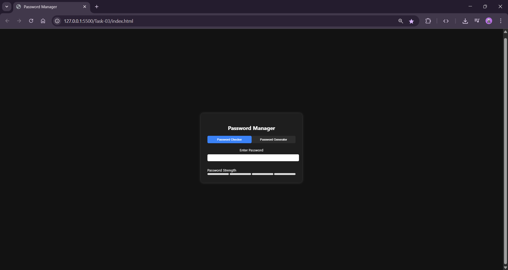
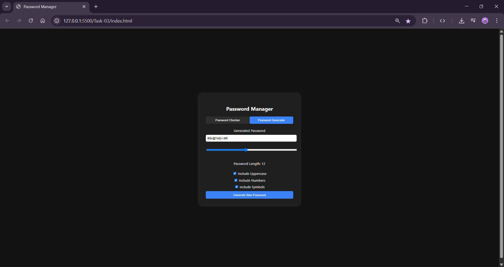

# Password Strength Checker 🔒

This project is a simple **Password Strength Checker** built using **HTML, CSS, and JavaScript**.  
It assesses the strength of a password based on:
- Password **length**
- Presence of **uppercase** and **lowercase** letters
- Presence of **numbers**
- Presence of **special characters**

---

## 📁 Folder Structure
Task-03/ 
├── index.html 
├── style.css 
├── script.js 
├── app.py
├── README.md 
├── output
    ├── 
    ├──

---

## 🚀 Features
- Live password strength checking
- Visual strength bar indicator
- Responsive and user-friendly UI
- Password Generator (optional tab)

---

## 🛠️ Technologies Used
- HTML5
- CSS3
- JavaScript (Vanilla JS)

---

## 🖼️ Screenshot

 

---

## 📜 How to Run
1. Clone the repository
2. Navigate to the `password-strength-checker` folder
3. Open `index.html` in your browser
4. Start testing your passwords!

---

## 💡 Future Improvements
- Add strength scoring system (Weak, Moderate, Strong)
- Add password tips for improving strength
- Better UI/UX styling

---

## 📚 License
This project is for educational purposes only.

---

> Developed **Shreeya Dave** as part of **SkillCraft Technology Task 03**
